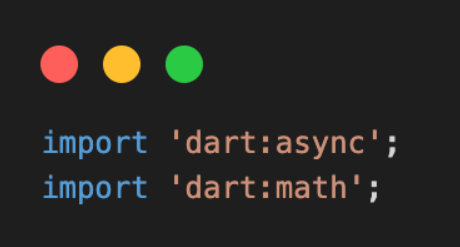
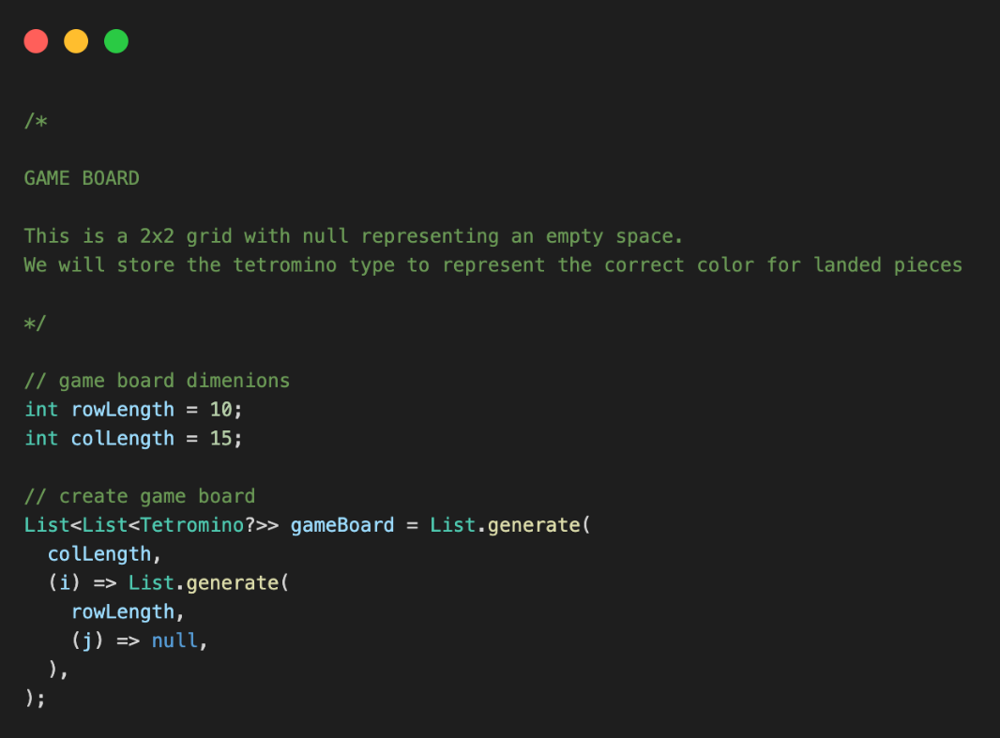
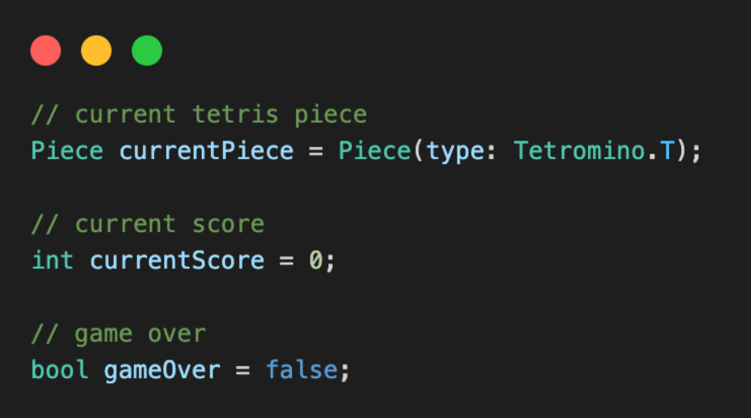
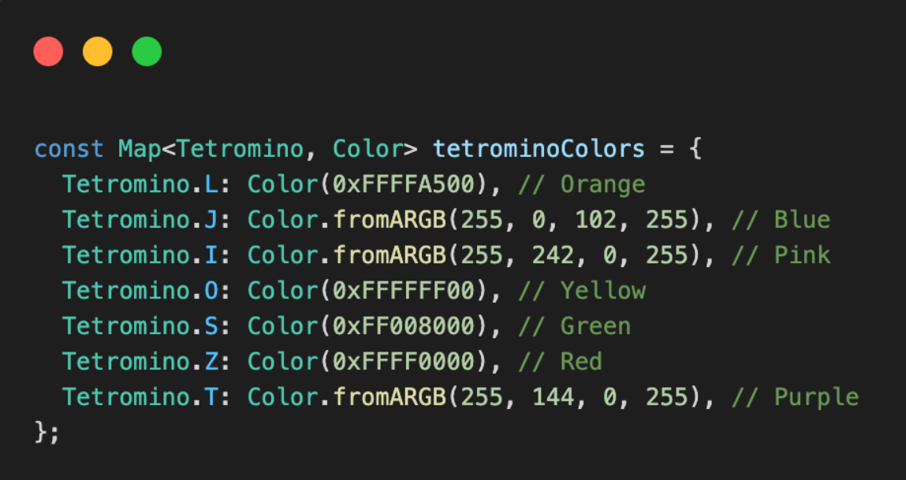
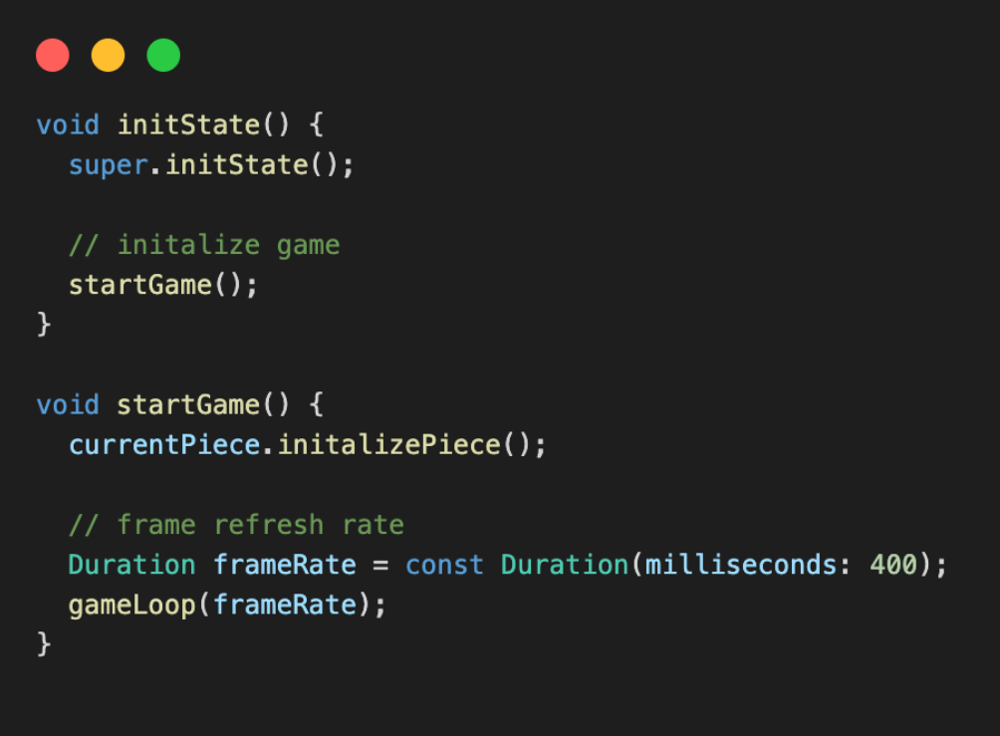
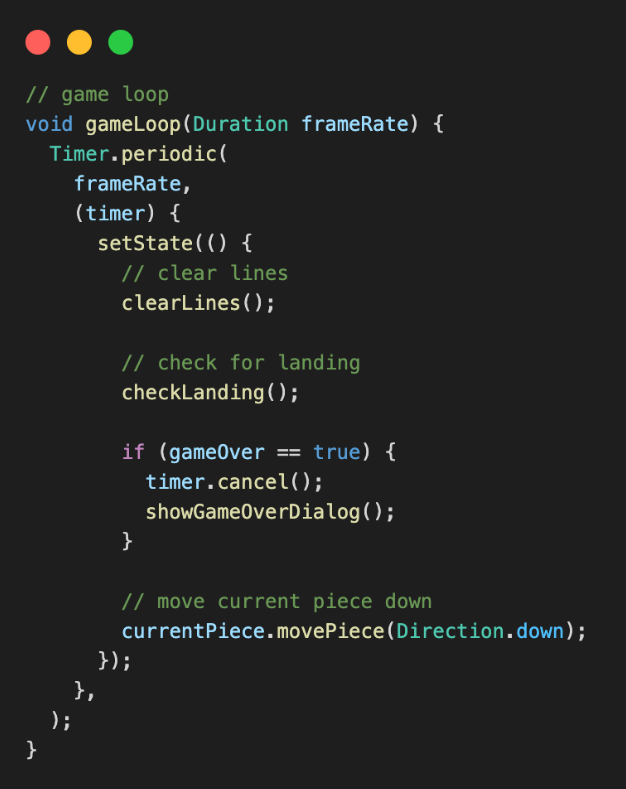
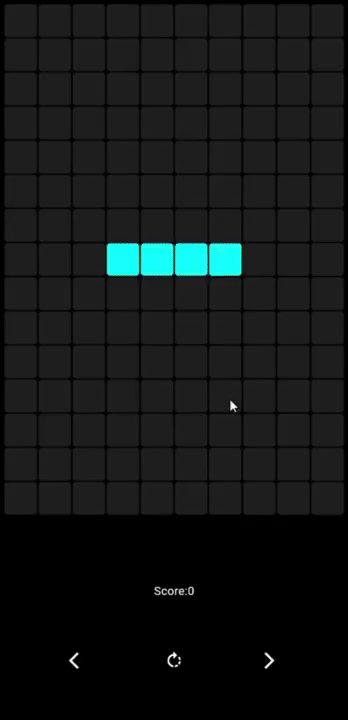

# Flutter Tetris Game

[Tetris](https://harddrop.com/wiki/Gameplay_overview) implementation
with [SRS](https://harddrop.com/wiki/SRS)
and [wall kicks](https://harddrop.com/wiki/SRS#Wall_Kicks)
. [Try it](https://ayush-bitla.github.io/Tetris/).

This is a simple Tetris game built purely in Flutter, without using any third-party packages. The game consists of a grid where Tetromino pieces appear and fall. The player can move and rotate the pieces to fit them together. The goal is to create full horizontal lines, which will then clear and grant points.

## 📌 Features
- Tetromino pieces appear and fall
- Move and rotate pieces
- Clear full horizontal lines
- Score tracking

## 🚀 Getting Started

### Prerequisites
Make sure you have Flutter installed. You can check by running:
```sh
flutter --version
```
If not installed, follow the official guide: [Flutter Installation](https://flutter.dev/docs/get-started/install)

### Installation
1. Clone this repository:
   ```sh
   git clone https://github.com/your-username/flutter-tetris.git
   ```
2. Navigate to the project directory:
   ```sh
   cd flutter-tetris
   ```
3. Run the project:
   ```sh
   flutter run
   ```

## 🛠️ Code Structure

### 1️⃣ Imports
This game is built purely in Flutter, using only basic Dart packages.



### 2️⃣ Game Board
The game board dimensions are defined by `rowLength` and `colLength`. The `gameBoard` is a 2D list representing the game grid.



### 3️⃣ Variables
- `currentPiece`: The active Tetromino piece.
- `score`: The player's score.
- `gameOver`: Boolean to check if the game has ended.
- `tetrominoColors`: Colors of the Tetromino pieces (modifiable).



### You can change the colors of the pieces here if you like!



### 4️⃣ Start Game
- `initState()`: Called when the game starts.
- `startGame()`: Initializes the game loop.



### 5️⃣ Game Loop
Uses the `dart:math` package to implement a timer that updates the game at regular intervals.



### 6️⃣ Player Controls
Methods to control the pieces:
- `moveLeft()`: Moves the piece left.
- `moveRight()`: Moves the piece right.
- `rotatePiece()`: Rotates the piece.

### 7️⃣ UI
The `build()` method constructs the game UI:
- Grid display
- Score counter
- Control buttons

[](https://ayush-bitla.github.io/Tetris/)

## 📜 License
This project is licensed under the MIT License - see the [LICENSE](LICENSE) file for details.

---

**Hope you enjoy the code and the game! Leave a ⭐ if you like it!** 🚀
